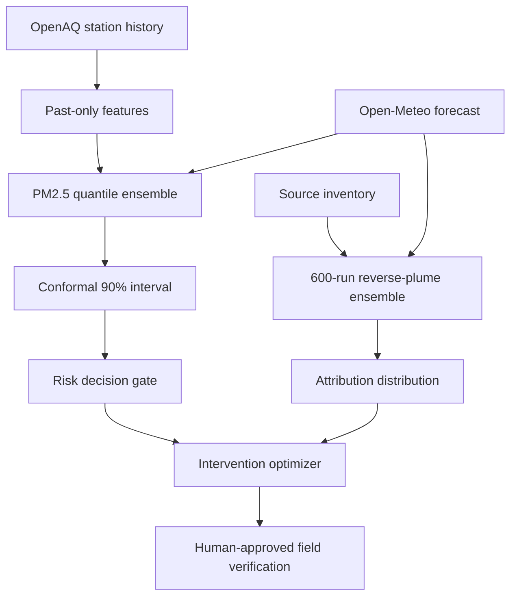

# AeroShield IQ v3 — Research-grounded upgrade

## Why this upgrade was necessary

The previous prototype was visually convincing, but three claims were not yet
scientifically defensible:

1. the validation split followed row/station ordering rather than a true future
   time block;
2. a single PM2.5 estimate was shown without predictive uncertainty; and
3. the largest normalized plume score was labelled as source "confidence",
   although it was not a calibrated probability.

The checked-in source inventory is also a demonstration inventory rather than
a regulator-verified emissions inventory. It must be replaced or independently
validated before any real-world attribution evaluation.

Version 3 changes the project from a forecasting dashboard into an
**uncertainty-aware intervention decision-support system**.

## Implemented architecture

### 1. Leakage-resistant evaluation

`pipeline/step3_etl_and_train.py` now:

- constructs lag values using past-only forward filling;
- orders samples globally by timestamp;
- uses 70% training, 15% calibration, and 15% test time blocks;
- fits missing-value statistics only on the training period; and
- reports model skill against a one-hour persistence baseline.

The test set is never used for early stopping or conformal calibration.

### 2. Calibrated probabilistic forecasts

Three LightGBM quantile models estimate the 10th, 50th, and 90th percentiles.
A held-out calibration block expands the lower/upper band using split conformal
calibration. The API returns the interval with every grid and point prediction.

Report both:

- empirical interval coverage; and
- mean interval width.

Coverage without interval width can be gamed by returning useless, very wide
intervals.

### 3. Probabilistic source attribution

`app/ml/plume_math.py` samples uncertainty in:

- wind direction;
- wind speed; and
- source inventory intensity.

Each of 600 simulations produces normalized source contributions. The API then
returns the mean contribution, 10th–90th percentile range, probability of being
ranked first, and an evidence grade. These values are explicitly described as
screening evidence—not proof of a statutory violation.

### 4. Counterfactual intervention ranking

`app/ml/intervention.py` ranks source-specific actions by conservative PM2.5
reduction, exposed population, sensitive sites, cost, and lead time. The lower
attribution quantile is used for the robust score, so an unstable source ranking
cannot dominate merely because its mean is high.

All actions require field verification. The language agent drafts an inspection
brief; it no longer declares a facility guilty or issues an autonomous legal
order.

### 5. Real forecast meteorology

`app/ml/weather.py` loads and caches forecast wind speed, direction, and boundary
layer height. If the public forecast endpoint is unavailable or the selected
time is outside its horizon, the API exposes the fallback explicitly.

## Research basis

| Source | What AeroShield uses from it |
|---|---|
| [AirFormer, AAAI 2023](https://ojs.aaai.org/index.php/AAAI/article/view/26676) | Joint spatial-temporal forecasting and explicit stochastic uncertainty for air quality. A future neural model can replace the current quantile trees when sufficient multi-station data and compute are available. |
| [E-STGCN](https://arxiv.org/abs/2411.12258) | Delhi-specific motivation for graph-based station modelling, extreme-pollution behaviour, multiple horizons, and conformal prediction intervals. |
| [WaveCatBoost](https://arxiv.org/abs/2404.05482) | Evidence that a tree-based probabilistic model plus conformal bands is a practical intermediate architecture on CPCB data. |
| [Graph WaveNet, IJCAI 2019](https://www.ijcai.org/proceedings/2019/0264.pdf) | Adaptive adjacency and dilated temporal modelling for a later station-graph forecaster. |
| [NOAA HYSPLIT](https://www.arl.noaa.gov/hysplit/) | Operational precedent for trajectories, atmospheric dispersion, and source–receptor analysis; the current Gaussian ensemble is a prototype, not a HYSPLIT replacement. |
| [A Gentle Introduction to Conformal Prediction](https://arxiv.org/abs/2107.07511) | Finite-sample split-conformal calibration and transparent coverage reporting. |

## Honest benchmark protocol

Run the complete pipeline, then report this table for 1, 3, 6, 12, 24, 48, and
72-hour horizons:

| Model | MAE | RMSE | Skill vs persistence | 90% coverage | Mean width |
|---|---:|---:|---:|---:|---:|
| Persistence | | | 0.000 | — | — |
| Seasonal median | | | | — | — |
| LightGBM point model | | | | — | — |
| Quantile + conformal (v3) | | | | | |
| E-STGCN / AirFormer-style model | | | | | |

Do not call the system "72-hour forecasting" until the target and lag generation
are changed to direct multi-horizon labels and this table is populated.

For source attribution, use synthetic release experiments or a verified emission
inventory and report top-1 accuracy, top-3 recall, Brier score, and calibration.
For interventions, have domain experts blind-rate relevance, feasibility, and
evidence quality.

## Highest-value next research phase

The next major modelling step should be a **wind-conditioned station graph**:

- nodes: CPCB/OpenAQ stations;
- physical edges: distance and wind-aligned connectivity;
- adaptive edges: learned hidden dependencies as in Graph WaveNet;
- temporal encoder: dilated causal convolutions or AirFormer-style attention;
- output: direct 1–72 hour quantiles;
- tail head: generalized Pareto component for severe pollution events; and
- calibration: horizon- and season-specific conformal scores.

That phase should be implemented only after expanding station coverage and
creating a reproducible multi-horizon dataset. With the present data, the v3
quantile-tree baseline is the stronger scientific default.
